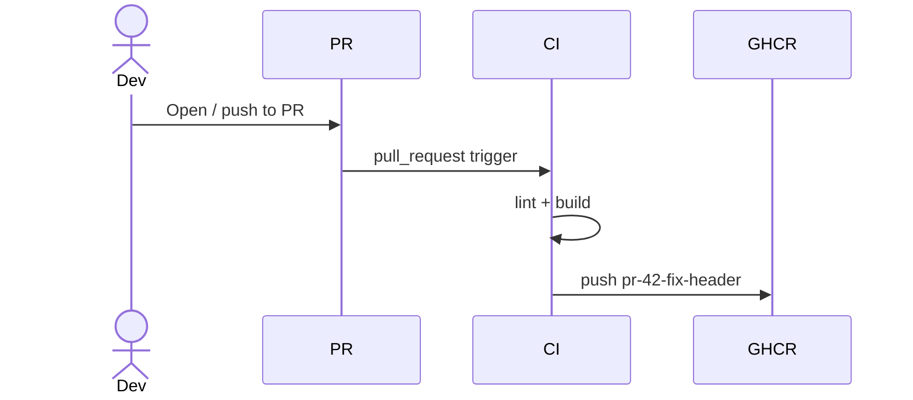
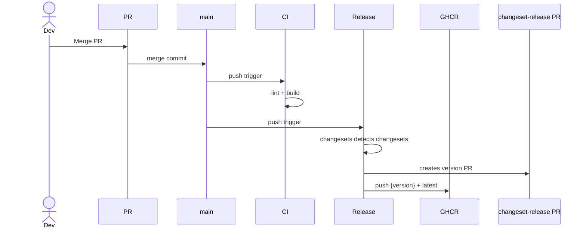
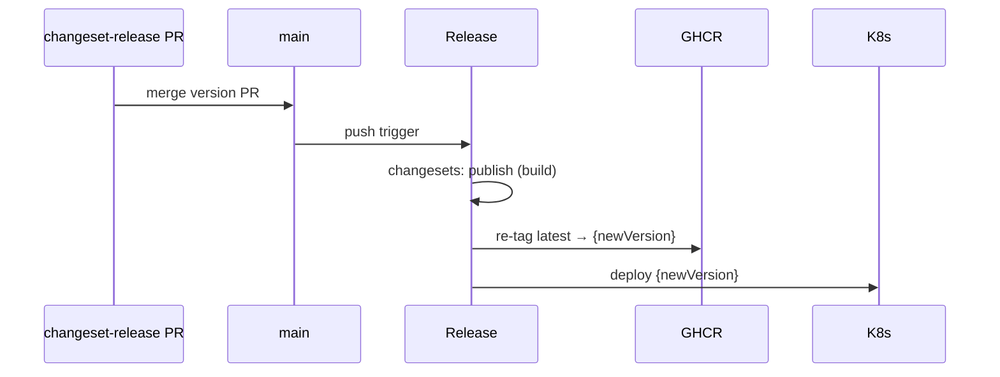

# CI/CD Demo

A React + Vite UI app served via nginx in a multi-stage Docker image. Uses [Changesets](https://github.com/changesets/changesets) for semantic versioning on `main` and ephemeral PR-specific Docker tags for pre-merge testing.

## Workflows

### PR Build

### Merge to Main

### Release (changeset-release merge → deploy)

